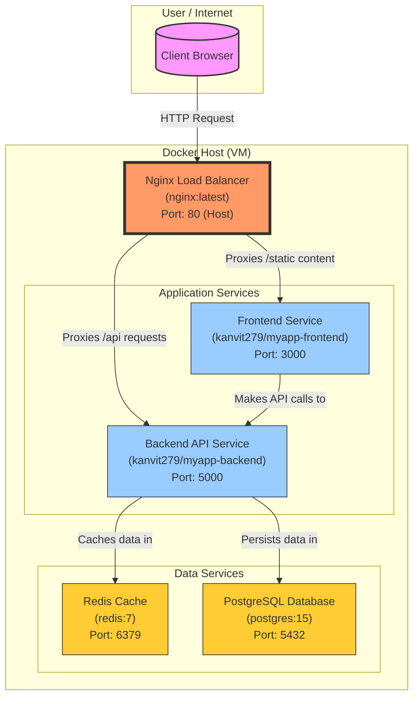

<!-- HEADER -->
<div align="center">

```
███╗   ███╗██╗ ██████╗██████╗  ██████╗ ███████╗███████╗██████╗ ██╗   ██╗██╗ ██████╗███████╗███████╗
████╗ ████║██║██╔════╝██╔══██╗██╔═══██╗██╔════╝██╔════╝██╔══██╗██║   ██║██║██╔════╝██╔════╝██╔════╝
██╔████╔██║██║██║     ██████╔╝██║   ██║███████╗█████╗  ██████╔╝██║   ██║██║██║     █████╗  ███████╗
██║╚██╔╝██║██║██║     ██╔══██╗██║   ██║╚════██║██╔══╝  ██╔══██╗╚██╗ ██╔╝██║██║     ██╔══╝  ╚════██║
██║ ╚═╝ ██║██║╚██████╗██║  ██║╚██████╔╝███████║███████╗██║  ██║ ╚████╔╝ ██║╚██████╗███████╗███████║
╚═╝     ╚═╝╚═╝ ╚═════╝╚═╝  ╚═╝ ╚═════╝ ╚══════╝╚══════╝╚═╝  ╚═╝  ╚═══╝  ╚═╝ ╚═════╝╚══════╝╚══════╝
```

### ⚡ PRODUCTION-READY MICROSERVICES ON DOCKER + AWS EC2 ⚡


---

> *"Ship fast. Scale smart. Break nothing."*

</div>

---

## 📡 SYSTEM ARCHITECTURE



---

## 🗂️ PROJECT STRUCTURE

```
microservices-app/
│
├── 📁 .github/
│   └── 📁 workflows/
│       └── 📄 deploy.yml          ← CI/CD Pipeline (GitHub Actions)
│
├── 📁 frontend/
│   ├── 📁 public/
│   ├── 📁 src/
│   ├── 📄 Dockerfile              ← Multi-stage: node:18-alpine → nginx:alpine
│   ├── 📄 .dockerignore
│   └── 📄 package.json
│
├── 📁 backend/
│   ├── 📄 server.js               ← Node.js API
│   ├── 📄 Dockerfile              ← node:18-alpine, Port :5000
│   ├── 📄 .dockerignore
│   └── 📄 package.json
│
├── 📁 nginx/
│   └── 📄 nginx.conf              ← Reverse proxy config
│
├── 📄 docker-compose.yml          ← Production orchestration
├── 📄 .env                        ← Environment variables (never commit!)
├── 📄 .gitignore
└── 📄 README.md
```

---

## 🐳 DOCKERFILES

### Frontend — Multi-Stage Build
```dockerfile
# ────────── Build Stage ──────────
FROM node:18-alpine AS build
WORKDIR /app
COPY package*.json ./
RUN npm install
COPY . .
RUN npm run build

# ────────── Production Stage ──────────
FROM nginx:alpine
COPY --from=build /app/build /usr/share/nginx/html
EXPOSE 80
CMD ["nginx", "-g", "daemon off;"]
```
> **Why multi-stage?** Final image is ~25MB vs ~400MB. Only static files shipped to production. Zero build tools in prod.

### Backend
```dockerfile
FROM node:18-alpine
WORKDIR /app
COPY package*.json ./
RUN npm install
COPY . .
EXPOSE 5000
CMD ["node", "server.js"]
```

---

## ⚙️ DOCKER COMPOSE

```yaml
version: '3.8'

services:

  frontend:
    image: your-dockerhub/myapp-frontend:latest
    restart: always
    networks:
      - app-network

  backend:
    image: your-dockerhub/myapp-backend:latest
    restart: always
    environment:
      DB_HOST: postgres
      POSTGRES_USER: ${POSTGRES_USER}
      POSTGRES_PASSWORD: ${POSTGRES_PASSWORD}
      POSTGRES_DB: ${POSTGRES_DB}
      REDIS_HOST: redis
    networks:
      - app-network
    mem_limit: 512m              # ← Resource limit
    cpus: 0.5                    # ← CPU constraint
    healthcheck:
      test: ["CMD", "curl", "-f", "http://localhost:5000/health"]
      interval: 30s
      timeout: 10s
      retries: 3

  postgres:
    image: postgres:15
    restart: always
    mem_limit: 512m
    cpus: 0.5
    environment:
      POSTGRES_USER: ${POSTGRES_USER}
      POSTGRES_PASSWORD: ${POSTGRES_PASSWORD}
      POSTGRES_DB: ${POSTGRES_DB}
    volumes:
      - pgdata:/var/lib/postgresql/data   # ← Named volume persistence
    networks:
      - app-network

  redis:
    image: redis:7
    restart: always
    networks:
      - app-network

  nginx:
    image: nginx:latest
    ports:
      - "80:80"
    volumes:
      - ./nginx/nginx.conf:/etc/nginx/nginx.conf
    depends_on:
      - frontend
      - backend
    networks:
      - app-network

volumes:
  pgdata:                        # ← Named volume

networks:
  app-network:                   # ← Isolated bridge network
```

---

## 🔀 NGINX CONFIG

```nginx
events {}

http {
    upstream backend {
        server backend:5000;
    }

    upstream frontend {
        server frontend:80;
    }

    server {
        listen 80;

        location /api {
            proxy_pass http://backend;
            proxy_set_header Host $host;
            proxy_set_header X-Real-IP $remote_addr;
        }

        location / {
            proxy_pass http://frontend;
            proxy_set_header Host $host;
            proxy_set_header X-Real-IP $remote_addr;
        }
    }
}
```

---

## 🔐 ENVIRONMENT VARIABLES (.env)

```bash
# Database
POSTGRES_USER=admin
POSTGRES_PASSWORD=your_strong_password_here
POSTGRES_DB=appdb

# Redis
REDIS_HOST=redis

# App
NODE_ENV=production
PORT=5000
```

> ⚠️ **NEVER commit `.env` to Git.** Add it to `.gitignore`. Use GitHub Secrets for CI/CD.

---

## 🚀 CI/CD PIPELINE (GitHub Actions)

```
┌─────────────────────────────────────────────────────────────┐
│                    PIPELINE FLOW                             │
│                                                             │
│  git push → main                                            │
│       │                                                     │
│       ▼                                                     │
│  ┌─────────────────────────────────────────────────────┐   │
│  │  JOB 1: Build & Push                                │   │
│  │  ① Checkout code                                    │   │
│  │  ② Login to Docker Hub                              │   │
│  │  ③ Build frontend image (multi-stage)               │   │
│  │  ④ Build backend image                              │   │
│  │  ⑤ Push both → Docker Hub                          │   │
│  └────────────────────────┬────────────────────────────┘   │
│                           │ needs: build                    │
│                           ▼                                 │
│  ┌─────────────────────────────────────────────────────┐   │
│  │  JOB 2: Deploy to EC2                               │   │
│  │  ① SSH into AWS EC2                                 │   │
│  │  ② Install Docker (if not present)                  │   │
│  │  ③ Write nginx.conf                                 │   │
│  │  ④ Write docker-compose.yml                         │   │
│  │  ⑤ Pull latest images                               │   │
│  │  ⑥ docker compose down → up -d                     │   │
│  │  ⑦ Cleanup old images                              │   │
│  └─────────────────────────────────────────────────────┘   │
│                                                             │
│                    🚀 DEPLOYED!                             │
└─────────────────────────────────────────────────────────────┘
```

### Required GitHub Secrets

| Secret | Description |
|---|---|
| `DOCKER_USERNAME` | Docker Hub username |
| `DOCKER_PASSWORD` | Docker Hub password / access token |
| `SERVER_HOST` | EC2 Public IP address |
| `SERVER_USER` | EC2 SSH user (e.g. `ubuntu`) |
| `SERVER_SSH_KEY` | Contents of your `.pem` private key |
| `POSTGRES_PASSWORD` | Production DB password |

---

## ⚡ QUICK START (Local Development)

```bash
# 1. Clone the repo
git clone https://github.com/your-username/microservices-app.git
cd microservices-app

# 2. Create environment file
cp .env.example .env
# Edit .env with your values

# 3. Start all services
docker compose up -d

# 4. Verify everything is running
docker ps

# 5. Open in browser
# → http://localhost       (Frontend via Nginx)
# → http://localhost/api   (Backend API)
```

---

## 📈 HORIZONTAL SCALING

```bash
# Scale backend to 3 replicas
docker compose up -d --scale backend=3

# Verify scaled containers
docker ps | grep backend
```

```
CONTAINER ID   IMAGE           STATUS         PORTS     NAMES
a1b2c3d4e5f6   myapp-backend   Up 2 minutes             myapp-backend-1
b2c3d4e5f6a1   myapp-backend   Up 2 minutes             myapp-backend-2
c3d4e5f6a1b2   myapp-backend   Up 2 minutes             myapp-backend-3
```

> Nginx automatically load-balances across all backend replicas using round-robin.

---

## 🔄 ZERO-DOWNTIME ROLLING UPDATE

```bash
# Pull new images & recreate containers with no downtime
docker compose pull
docker compose up -d --no-deps --build backend

# Or trigger via CI/CD — just git push!
git push origin main
```

---

## 🏥 HEALTH CHECKS

```bash
# Check all container health status
docker ps --format "table {{.Names}}\t{{.Status}}\t{{.Ports}}"

# Backend health endpoint
curl http://localhost/api/health
# → {"status":"ok","uptime":3600,"db":"connected","cache":"connected"}

# View logs
docker compose logs -f backend
docker compose logs -f nginx
```

---

## 📊 RESOURCE MONITORING

```bash
# Live resource usage (CPU, Memory)
docker stats

# Expected output:
# CONTAINER       CPU %   MEM USAGE / LIMIT     MEM %
# backend-1       0.5%    128MiB / 512MiB       25%
# backend-2       0.3%    115MiB / 512MiB       22%
# postgres        1.2%    210MiB / 512MiB       41%
# redis           0.1%    12MiB / -             -
# nginx           0.0%    4MiB / -              -
# frontend        0.0%    6MiB / -              -
```

---

## 🧹 CLEANUP COMMANDS

```bash
# Stop all containers
docker compose down

# Stop and remove volumes (⚠️ deletes DB data!)
docker compose down -v

# Remove unused images
docker image prune -f

# Nuclear option — remove everything
docker system prune -af --volumes
```

---

## ☁️ AWS EC2 SETUP (One-Time)

```bash
# 1. Launch EC2 instance (Ubuntu 22.04, t2.micro or higher)
# 2. Open inbound port 80 in Security Group
# 3. Add your GitHub Secrets (see table above)
# 4. Push to main → pipeline deploys automatically!

# Manual SSH (only needed to debug)
ssh -i your-key.pem ubuntu@your-ec2-public-ip

# Check deployed containers
sudo docker ps
```

---

## 🏗️ TECH STACK

| Layer | Technology | Purpose |
|---|---|---|
| **Frontend** | React + nginx:alpine | UI · Served as static files |
| **Backend** | Node.js 18 | REST API · Business logic |
| **Database** | PostgreSQL 15 | Persistent relational data |
| **Cache** | Redis 7 | Sessions · Rate limiting · Speed |
| **Proxy** | Nginx | Reverse proxy · Load balancer |
| **Container** | Docker + Compose | Orchestration · Isolation |
| **CI/CD** | GitHub Actions | Automated build & deploy |
| **Cloud** | AWS EC2 | Production hosting |

---

## ✅ REQUIREMENTS CHECKLIST

- [x] Multi-stage Docker builds (frontend: node → nginx)
- [x] Health checks for backend service
- [x] Docker Compose v3.8+
- [x] Environment variable management via `.env`
- [x] Resource limits (CPU: 0.5, Memory: 512m)
- [x] Named volumes for database persistence (`pgdata`)
- [x] Horizontal scaling of backend (`--scale backend=N`)
- [x] Zero-downtime rolling updates
- [x] **BONUS** CI/CD pipeline via GitHub Actions
- [x] **BONUS** Images pushed to Docker Hub
- [x] **BONUS** Deployed on AWS EC2


---

<div align="center">


---

### 🛰️ TECH ARSENAL


---

### 🚀 DEPLOYED & LIVE ON AWS EC2

> *Containerized. Scaled. Automated. Production-Ready.*

---
```
██████╗  █████╗ ██████╗ ███████╗██╗  ██╗ █████╗ ███╗   ██╗████████╗
██╔══██╗██╔══██╗██╔══██╗██╔════╝██║  ██║██╔══██╗████╗  ██║╚══██╔══╝
██████╔╝███████║██████╔╝███████╗███████║███████║██╔██╗ ██║   ██║   
██╔═══╝ ██╔══██║██╔══██╗╚════██║██╔══██║██╔══██║██║╚██╗██║   ██║   
██║     ██║  ██║██║  ██║███████║██║  ██║██║  ██║██║ ╚████║   ██║   
╚═╝     ╚═╝  ╚═╝╚═╝  ╚═╝╚══════╝╚═╝  ╚═╝╚═╝  ╚═╝╚═╝  ╚═══╝   ╚═╝   
```

---

[](https://github.com/Parshant1231)


<sub>Built with 🔥 by <b>Parshant</b> — Ship fast. Scale smart. Break nothing.</sub>

</div>